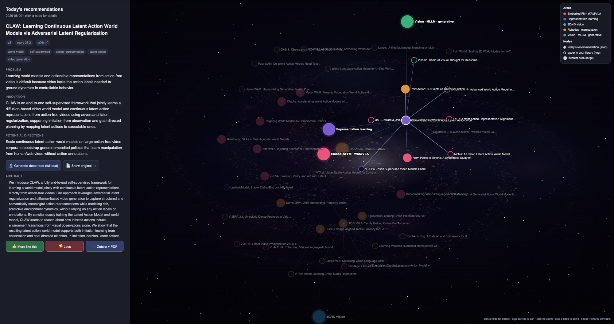

# 📚🛰️ Research Agent — Zotero × Obsidian × Claude Code

Turn your **Zotero** library and your own highlights into a personal research
assistant that **fetches new papers every day, ranks them to your taste, explains
each one, answers questions grounded in your library, and shows it all as an
interactive "galaxy" knowledge graph** — right in your terminal and browser.

It is powered by [**Claude Code**](https://www.anthropic.com/claude-code) (the
agent does the reasoning) and a handful of **dependency-free Python scripts**
(stdlib only — nothing to `pip install`). Your Zotero database is read **read-only**;
the agent never modifies it.

> New to these tools? **Zotero** is a free reference manager (your paper library).
> **Obsidian** is a free Markdown notes app. **Claude Code** is Anthropic's CLI
> coding/agent tool. You need Zotero + Claude Code; Obsidian is optional (the notes
> are plain Markdown you can read in any editor).



*The interactive knowledge graph (`tools/viz.py --serve`): today's recommendations
linked to your interest **areas** and the **library papers** they share concepts
with, over an animated galaxy. Click any paper for its value card, a full **deep
read**, the original **PDF** side-by-side, and **👍 / 👎 / ➕** actions.*

---

## ✨ What you get

- **Daily paper recall** — pulls the newest relevant arXiv papers + Semantic Scholar
  recommendations seeded by *your* library, scored against your interests, deduped
  against what you already have.
- **Auto value cards** — every recommended paper gets a *Problem / Innovation /
  Potential directions* card generated automatically.
- **Interactive knowledge graph** — a self-contained HTML page with an animated
  galaxy background. Each paper links to your interest **areas** and to the specific
  **library papers it shares concepts with**. Click a node to read its value card,
  generate a full **deep read**, view the **original PDF** side-by-side, and give
  **👍 / 👎 feedback** that steers tomorrow's recommendations.
- **Grounded Q&A** — ask questions and get answers cited to your own notes and
  highlights, never invented.
- **Deep paper digests** — a 6-section method-focused analysis of any paper.
- **Research synthesis** — mine open problems, generate novel ideas, weekly digests.
- **Learns your taste** — feedback + your Zotero highlights continuously retune what
  it surfaces.

---

## 🧩 How it works (architecture)

```
        ┌─────────────┐   read-only    ┌──────────────────────────┐
        │   Zotero    │ ─────────────▶ │ tools/*.py (stdlib only) │
        │ (your lib)  │  zotero.sqlite │  fetch · sync · score ·  │
        └─────────────┘   (immutable)  │  graph · feedback        │
                                        └────────────┬─────────────┘
   arXiv + Semantic Scholar ───────────────────────▶ │ writes Markdown + JSON
                                                      ▼
   ┌───────────────────────────────────────────────────────────────────┐
   │  The vault (plain Markdown — open in Obsidian or any editor)        │
   │  Literature/  Topics/  Inbox/  Daily/  Research/                    │
   └───────────────────────────────────────────────────────────────────┘
                                                      ▲
        ┌─────────────┐  /papers /ask /research      │ reasoning, summaries,
        │ Claude Code │ ─────────────────────────────┘ deep reads, value cards
        └─────────────┘
```

- The **Python tools** do all the deterministic work (DB reads, fetching, scoring,
  graph rendering) and need no API key.
- **Claude Code** is the brain for anything that requires understanding: answering
  questions, writing digests/value cards, idea generation.

---

## ✅ Prerequisites

| Requirement | Why | Notes |
|---|---|---|
| **Python 3.9+** | runs the tools | stdlib only — no packages to install |
| **Zotero 7+** | your paper library | desktop app, free — <https://www.zotero.org> |
| **Claude Code** *or* **OpenAI Codex** | the agent (Q&A, value cards, deep reads) | [Claude Code](https://www.anthropic.com/claude-code) · [Codex](https://developers.openai.com/codex) — pick one (see [below](#-choose-your-agent-claude-code-or-openai-codex)) |
| Obsidian *(optional)* | nicer reading of the vault | <https://obsidian.md> |
| `S2_API_KEY` *(optional)* | higher Semantic Scholar rate limits | free key: <https://www.semanticscholar.org/product/api> |

**Enable the Zotero connector (needed only to *save* papers into Zotero):**
Zotero → Settings → Advanced → check *"Allow other applications on this computer to
communicate with Zotero."* (Reading your library does **not** need this.)

Works on **macOS / Linux / Windows** for manual use. The scheduled daily job ships
with a one-command installer for **macOS (launchd)**; a **cron** snippet is provided
for Linux.

---

## 🚀 Quick start

```bash
# 1. Clone
git clone https://github.com/hengcaoai-cloud/awesome-research-agent.git ~/Paper
cd ~/Paper

# 2. (optional) tell it where Zotero lives, if not the default ~/Zotero
export ZOTERO_DIR="$HOME/Zotero"
# export S2_API_KEY="..."   # optional, for better recommendations

# 3. Run the guided setup (checks prerequisites, builds your notes from Zotero)
bash tools/setup.sh

# 4. Fetch today's papers + auto-generate value cards
python3 tools/fetch.py
python3 tools/digest_cards.py     # needs Claude Code; fills the value cards

# 5. Open the interactive knowledge graph (with live 👍/👎 + PDF + deep-read)
python3 tools/viz.py --serve      # opens http://127.0.0.1:8765
```

Then point Claude Code at the folder and try a command:

```bash
cd ~/Paper && claude
# inside Claude Code:
/papers          # fetch + digest today's papers
/ask  what are the open problems in world models?
```

> **Tip:** Open `~/Paper` as a vault in Obsidian to browse `Literature/` and
> `Topics/` with backlinks and graph view.

---

## ⏰ Daily automation (optional but recommended)

Have it fetch, rank, write value cards and render the graph **every morning**.

**macOS (launchd) — one command:**

```bash
bash tools/install_schedule.sh        # daily 07:00 + weekly Sun 07:30
# remove later with:  bash tools/install_schedule.sh --uninstall
```

**Linux (cron):**

```bash
crontab -e
# add (adjust the path):
0 7 * * *   cd $HOME/Paper && PAPER_AGENT_LLM=1 /bin/bash tools/daily.sh
30 7 * * 0  cd $HOME/Paper && /bin/bash tools/weekly.sh
```

`PAPER_AGENT_LLM=1` lets the job call Claude Code for value cards + the reading
plan. Without it, you still get the ranked fetch (free, no tokens).

---

## 🕹️ Using it

### Slash commands (in Claude Code) — 4 hubs

| Command | What it does |
|---|---|
| `/papers [fetch\|digest\|triage\|keep <id>\|drop <id>]` | the daily paper flow: fetch → value cards + graph → clickable triage; `keep`/`drop` teach the recommender |
| `/ask <question \| paper \| connect [theme]>` | answer grounded in your library; or digest one paper (with citation lineage); or surface non-obvious links |
| `/research [gaps\|ideas\|weekly]` | mine open problems · propose novel directions · weekly synthesis (saved to `Research/`) |
| `/sync-vault` | rebuild the notes + topic maps from Zotero |

### The knowledge graph (`tools/viz.py`)

```bash
python3 tools/viz.py            # write a static Daily/<date>-graph.html
python3 tools/viz.py --serve    # live server with feedback + PDF + deep read
```

In the live graph, click any **paper node** (solid dot) to:
- read its **value card** (problem / innovation / directions),
- **🔬 Generate deep read** — fetches the paper's full text and writes a detailed
  6-section method analysis (with rendered math),
- **📄 Show original** — embeds the real arXiv **PDF** beside the analysis,
- **👍 / 👎 / ➕** — teach the recommender, or save the paper (with PDF) to Zotero.

Hollow rings = papers already in your library; large nodes = your interest areas.

### Saving papers to Zotero

```bash
python3 tools/zotero_add.py 2606.05979            # → 'Recommend' collection, with PDF
python3 tools/zotero_add.py 2606.05979 --collection "VLA"
```
Auto-routes into a fixed collection (default `Recommend`) — no clicking in Zotero.

---

## ⚙️ Configuration

### Environment variables

| Variable | Default | Meaning |
|---|---|---|
| `ZOTERO_DIR` | `~/Zotero` | folder containing `zotero.sqlite` |
| `PAPER_ROOT` | `~/Paper` | the vault/project folder (used by the scheduled job) |
| `S2_API_KEY` | – | Semantic Scholar API key (optional, better recs) |
| `PAPER_AGENT_LLM` | `0` | `1` lets the daily job call the agent for cards/plan |
| `RESEARCH_AGENT_LLM` | `claude` | which agent CLI the tools use: `claude` or `codex` |

### Your interests — `.interests.yaml`

This file tunes what gets surfaced. Add/raise `boost:` keywords, add `mute:` terms
to suppress topics, set `arxiv_categories:`, and tune the quotas (`top_arxiv`,
`top_s2`, `min_score`, `lookback_days`). The fetcher **also** learns automatically
from your library every run (highlighted papers count more), so just by reading and
highlighting in Zotero you steer it. Edit freely — it's a living profile.

---

## 🤖 Choose your agent: Claude Code or OpenAI Codex

The reasoning (Q&A, value cards, deep reads, digests) is done by an agent CLI. This
project works with **either** [Claude Code](https://www.anthropic.com/claude-code)
(default) or [OpenAI Codex](https://developers.openai.com/codex) — the Python tools
call whichever you choose via `RESEARCH_AGENT_LLM`. Everything else (fetch, scoring,
graph, Zotero) is identical.

**Claude Code (default):** nothing to set. Instructions live in `CLAUDE.md`; the four
slash commands are in `.claude/commands/`.

**OpenAI Codex:**
```bash
export RESEARCH_AGENT_LLM=codex      # tools now call `codex exec` instead of `claude -p`
```
- **Instructions:** Codex reads **`AGENTS.md`** (shipped — it mirrors `CLAUDE.md`).
- **Slash commands:** Codex loads personal prompts from `~/.codex/prompts/`. Reuse
  this repo's commands:
  ```bash
  mkdir -p ~/.codex/prompts
  ln -s "$PWD/.claude/commands/"*.md ~/.codex/prompts/   # → /papers /ask /research /sync-vault
  ```
- Then run `codex` in the project folder and use `/papers`, `/ask …`, etc.

Set `RESEARCH_AGENT_LLM` in your shell **and** in the scheduled job's environment so
`digest_cards.py`, the graph's deep-read button, and `daily.sh` / `weekly.sh` all use
your chosen agent.

## 🗂️ Project layout

```
Paper/
├── CLAUDE.md            # instructions the agent follows (the "system prompt")
├── .interests.yaml      # your interest profile for the fetcher (edit me)
├── tools/               # all the Python tools (stdlib only) + shell scripts
│   ├── zotero_read.py   #   read-only Zotero access (immutable sqlite)
│   ├── lit_note.py      #   Zotero → Markdown notes + topic maps
│   ├── fetch.py         #   daily recall (arXiv + Semantic Scholar), scored
│   ├── paperlib.py      #   shared fetch/scoring logic
│   ├── digest_cards.py  #   auto value cards (problem/innovation/directions)
│   ├── viz.py           #   interactive knowledge-graph server
│   ├── zotero_add.py    #   save a paper (+PDF) to Zotero via the connector
│   ├── s2_graph.py      #   citation lineage + frontier
│   ├── feedback.py      #   keep/drop signals that retune recall
│   ├── daily.sh / weekly.sh        # the scheduled jobs
│   └── setup.sh / install_schedule.sh
├── .claude/commands/    # the 4 slash commands
├── Literature/          # one Markdown note per paper  (generated; gitignored)
├── Topics/              # one map-of-content per Zotero collection (generated)
├── Inbox/               # freshly fetched candidates + agent state (generated)
├── Daily/               # daily logs + reading plans + graphs (generated)
└── Research/            # gaps / ideas / weekly outputs (generated)
```

The `Literature/ Topics/ Inbox/ Daily/ Research/` folders are **your personal data**
and are git-ignored — a fresh clone starts empty and fills as you use it.

---

## 🔐 Privacy & safety

- **Zotero is read-only.** Tools open `zotero.sqlite` with `immutable=1` and never
  write to it — safe even while Zotero is running.
- **Saving** papers (`zotero_add.py` / the ➕ button) is the only thing that writes,
  and it goes through Zotero's own connector with your permission.
- The graph server binds to **`127.0.0.1`** (localhost only).
- Your library content stays local. Claude Code sends only what's needed for a given
  request (an abstract, a question) to Anthropic — review Anthropic's data policy.
- `.gitignore` keeps your personal notes, PDFs and state **out of git** by default.

---

## 🧪 Troubleshooting

| Symptom | Fix |
|---|---|
| `zotero.sqlite not found` | set `ZOTERO_DIR` to your Zotero data folder |
| Recommendations feel off / sparse | edit `.interests.yaml`; set `S2_API_KEY`; use 👍/👎 |
| `zotero_add` says connector not reachable | enable the connector toggle (see Prerequisites) and keep Zotero open |
| Value cards / deep read fail | make sure `claude` (Claude Code) is installed and on `PATH` |
| Graph shows no papers | run `python3 tools/fetch.py` first |
| Saved paper has no PDF | the paper may have no arXiv PDF; check the id |

---

## 🌱 Extending

- Add a new slash command: drop a Markdown file in `.claude/commands/`.
- Change the graph's interest **areas**: edit `AREAS` in `tools/viz.py`.
- `/research ideas` uses the optional Claude Code skills *idea-generation* and
  *novelty-assessment* if installed; it degrades gracefully without them.

---

## 📦 Publishing your own copy

```bash
cd ~/Paper
git init && git add . && git commit -m "Research agent"
git branch -M main
git remote add origin https://github.com/<you>/research-agent.git
git push -u origin main
```
The `.gitignore` already excludes your personal library data, caches and logs.

---

## 📄 License

MIT — see [LICENSE](LICENSE). Built on top of [Claude Code](https://www.anthropic.com/claude-code),
[Zotero](https://www.zotero.org), [arXiv](https://arxiv.org) and
[Semantic Scholar](https://www.semanticscholar.org).
